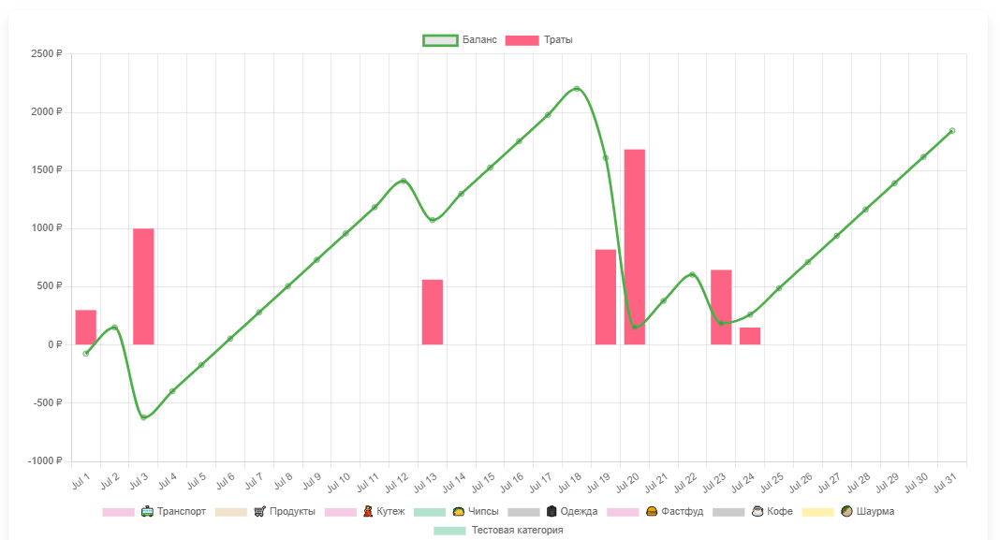

# Веб-сайт для управления бюджетом

## О проекте

Сайт помогает решить следующие цели:

- Контролировать ежедневные траты, отображать текущие свободные средства
- Визуализировать повседневные траты на диаграммах
- Следить за достижением финансовых целей
- Отслеживать регулярные ежемесячные траты
- Копить средства

## Сборка проекта

Требования: Python 3.7+, pip3.

- `git clone https://github.com/Temikmapper77/komanda.git`
- `cd komanda`
- `python3 -m venv venv`
- `source venv/bin/activate`
- `pip3 install -r komanda/requirements/production.txt`
- `cd komanda`
- `python3 manage.py makemigrations expenses incomes goals piggy monthly`
- `python3 manage.py migrate`
- `python3 manage.py runserver`

## Скриншоты

Посмотреть

### Страница добавления трат

### Список недавно добавленных трат

### Список добавленных категорий

### Таблица ежемесячных трат

### График с ежемесячными тратами

### Страница с финансовой целью

